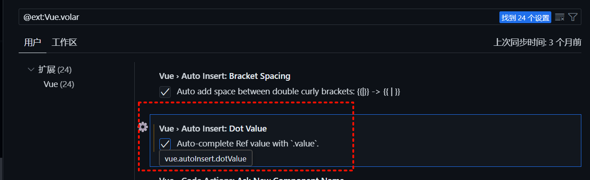
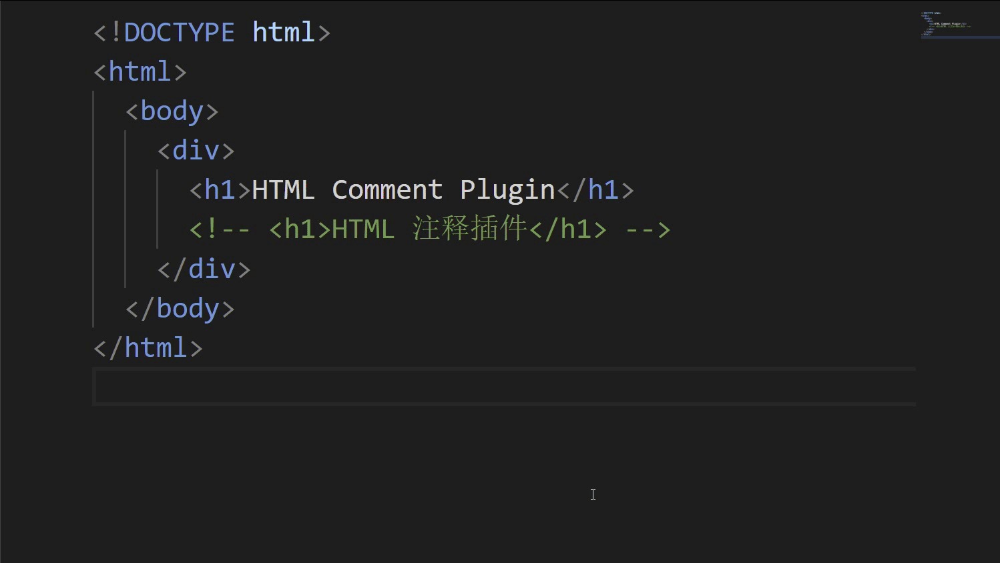
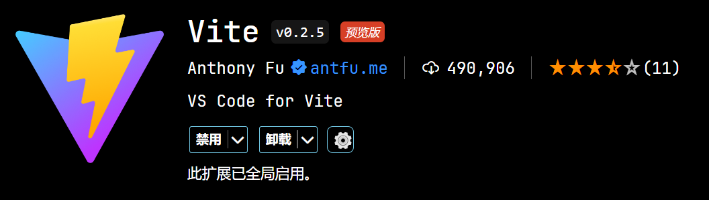
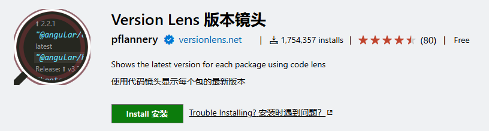
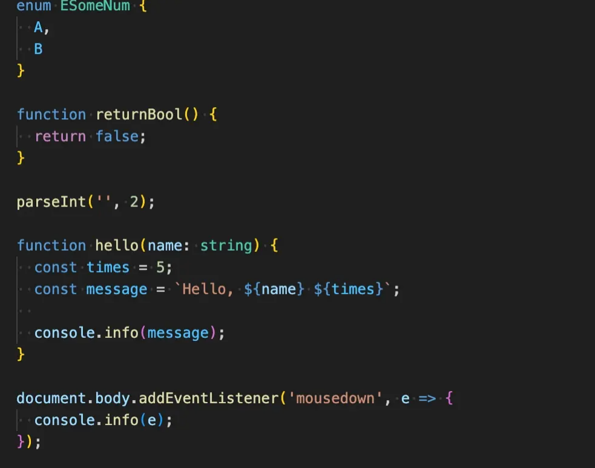
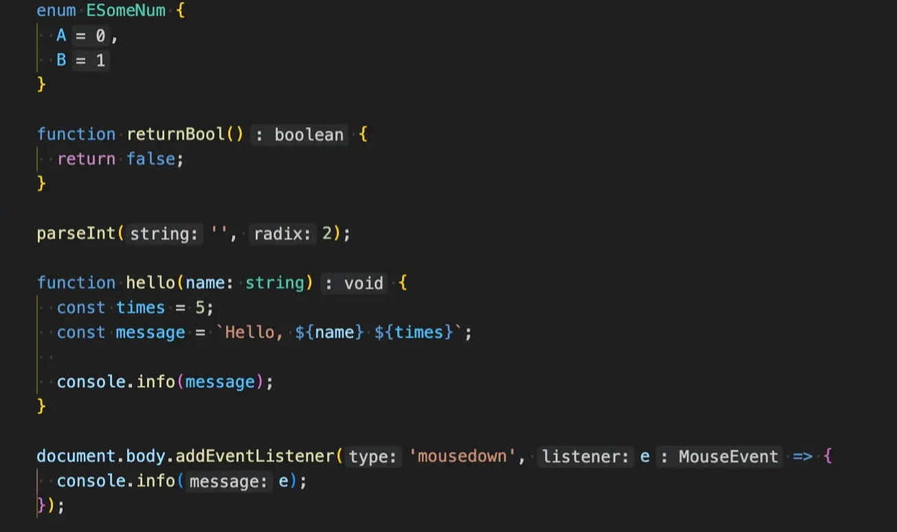
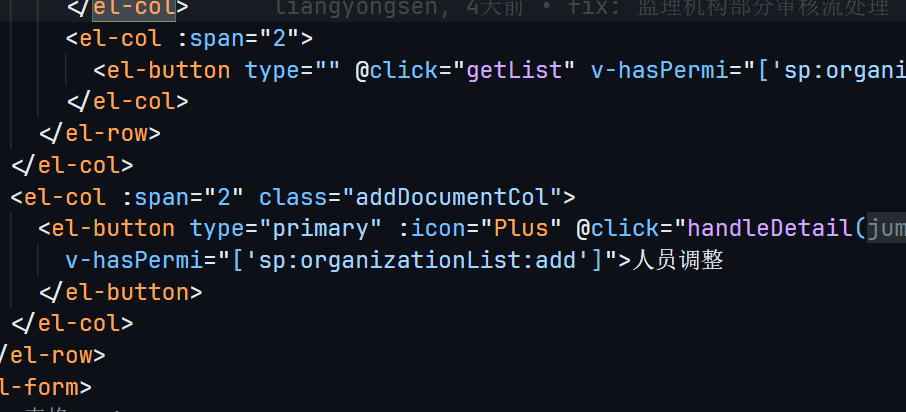
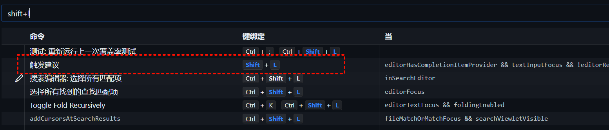
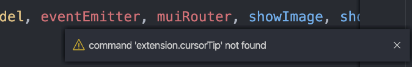

# VSCode

在使用 VSCode 过程中的常用插件、配置、快捷键等

## 常用快捷键
- `Ctrl + P`：快速打开文件
- `Ctrl + Shift + P`：打开命令面板
- `Ctrl + F`：全局搜索
- `Ctrl + H`：全局替换
- `Ctrl + Shift + F`：在当前文件夹中搜索
- `Ctrl + Shift + H`：在当前文件夹中替换
- `Ctrl + G`：跳转到指定行
- `Ctrl + Shift + G`：跳转到指定行并选择
- `Alt + Up`：向上移动行
- `Alt + Down`：向下移动行
- `Ctrl + Shift+K`：删除当前行
- `Ctrl + Enter`：在当前行下方插入一行
- `Ctrl + Shift + Enter`：在当前行上方插入一行
- `Ctrl + Shift + [`：折叠代码块
- `Ctrl + Shift + ]`：展开代码块
- `Ctrl + K Ctrl + [`：折叠所有代码块
- `Ctrl + K Ctrl + ]`：展开所有代码块
- `Ctrl + K Ctrl + 0`：折叠所有代码块
- `Alt + Shift + o` ：import优化
- `Ctrl + ` `  ：打开终端界面
- `Ctrl + K Ctrl + T`：选择主题


## 插件推荐

### Vue - Official


提供 vue3 语法提示、代码片段、智能感知、错误检查

默认配置没有对 ref 进行优化，需要在扩展设置中配置


勾选 Auto Insert



操作 ref 数据时，自动补全.value


### HTML-Comment


html 的注释嵌套使用时都会发现并不能达到我们想到的效果，正常情况以下注释会报错，这时候可以用这个插件来解决这类报错



原生的方法是不支持这种嵌套注释的，只能使用变种方法进行多级注释，所以可以使用该插件解决，该插件效果如下


### Element Plus Snippets


Element Plus 代码片段

### Smart Clicks


可以自动识别需要选中的内容

### Vite



编辑器打开vite项目自动启动项目



可以在package.json显示是否为最新版本且可以一键升级


## 配置推荐

个人编辑器配置推荐

### 文件标签栏多行显示

[**操作链接**](https://blog.csdn.net/mj475002864/article/details/115456004)

### 设置代码片段

写代码过程中经常有一些代码需要重复写，这时候使用代码片段来提高效率，只需要输入代码片段的前缀，然后按下 Tab 键即可插入代码片段，按下换行键可以切换到下一个输入点。


#### 详细操作教程

[**利用 VS Code 代码片段提高编码效率**](https://fengchao.pro/blog/vscode-snippets/)

#### 个人常用

##### vue3 单页面

```json
{
  "v3page": {
    "scope": "vue",
    "prefix": "v3",
    "body": [
      "<template>",
      "$0    <div>",
      "$4",
      "$0    </div>",
      "</template>",
      "",
      "<script setup lang=\"ts\">",
      "$4",
      "</script>",
      "$4",
      "<style lang=\"scss\" scoped>",
      "$4",
      "</style>"
    ],
    "description": "vue3"
  }
}
```

##### vue3 方法

```json
{
  "v3Fn": {
    "prefix": "v3F",
    "body": ["const ${1} = () => {", "  ${2}", "}"],
    "description": "v3Fn"
  }
}
```

##### Scss 宽高混入

```json
{
  "ScssSize": {
    "prefix": "size",
    "body": ["@include size(${1},${2});"],
    "description": "ScssSize"
  }
}
```

##### Scss Flex

```json
{
  "ScssFlex": {
    "prefix": "flex",
    "body": ["@include flex(${1},${2});"],
    "description": "ScssFlex"
  }
}
```

### 开启内嵌提示

内嵌提示（Inlay Hint）对提升代码阅读效率很重要，建议开启。

#### 具体操作

设置：能勾选的都勾选，能选「all」的都选「all」

settings.json：[language].inlayHints.[what].enabled

#### 效果

默认


开启后


### 快捷键显示类型提示

通过 ctrl+i 快捷键可以触发类型提示



如果没有反应的话就是有重复的快捷键了，需要更改快捷键



## 错误

### 显示找不到该快捷键命令



快捷键占用了，重新设置一个
