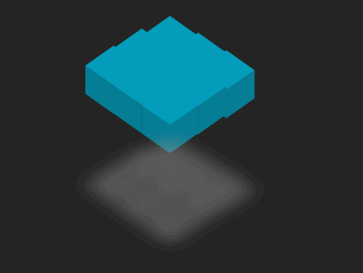

# Css案例

## 倾斜跳动盒子



实现思路： 先给一个面做两个伪元素::after、::before，然后分别做位置转换，最后再复制多个相同盒子，设置不同延迟时间并开启透视，做好父盒子和子盒子群倾斜角度就可以了

```vue
<template>
  <div class="h-screen flex justify-center items-center">
    <div class="cube-group">
      <div class="cube" style="--i: 1"></div>
      <div class="cube" style="--i: 2"></div>
      <div class="cube" style="--i: 3"></div>
      <div class="cube" style="--i: 4"></div>
      <div class="cube" style="--i: 5"></div>
      <div class="cube" style="--i: 6"></div>
      <div class="cube" style="--i: 7"></div>
      <div class="cube" style="--i: 8"></div>
      <div class="cube" style="--i: 9"></div>
    </div>
  </div>
</template>

<style scoped lang="scss">
.cube-group {
  --size: 50px;
  width: calc(var(--size) * 3);
  height: calc(var(--size) * 3);
  display: grid;
  transform-style: preserve-3d;	// 开启透视
  transform: rotateX(45deg) rotateZ(45deg);
  grid-template-columns: var(--size) var(--size) var(--size);
  grid-template-rows: var(--size) var(--size) var(--size);
}

.cube {
  transform-style: preserve-3d;   // 开启透视
  background: #049dbc;
  width: var(--size);
  height: var(--size);
  animation: up-down 1s infinite calc(var(--i) / 5 * -0.2s);
  box-shadow: calc(var(--size) * 3) calc(var(--size) * 3) calc(var(--size) /2) rgba(145, 143, 143, 0.497);

  &::before {
    transform-origin: left top;
    content: '';
    width: var(--size);
    height: var(--size);
    display: block;
    background: #057d95;
    transform: translateX(var(--size)) rotateY(90deg);
  }


  &::after {
    transform-origin: left top;
    content: '';
    width: var(--size);
    height: var(--size);
    display: block;
    background: #057d95;
    transform: rotateX(-90deg);
  }
}

@keyframes up-down {
  50% {
    transform: translateZ(calc(var(--size)));
  }
}
```

