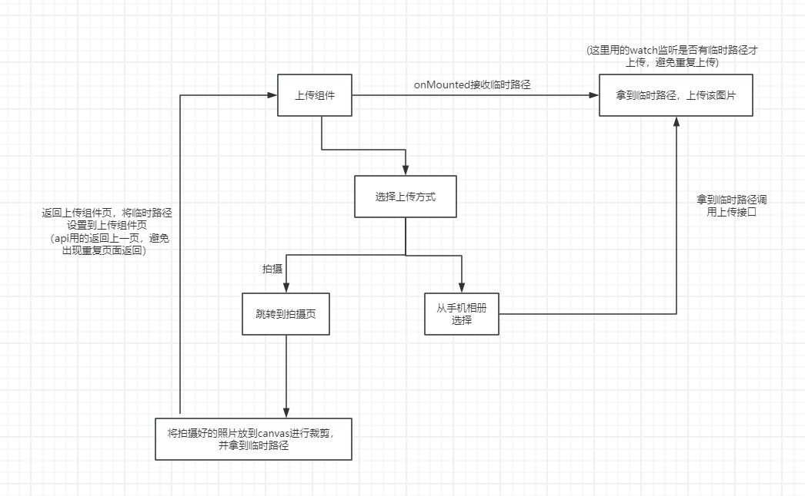

# 小程序日常开发笔记

## 小程序拍照增加边框功能

具体流程图



具体相机页代码

```ts
<!--
 * @Author: cjw
 * @Date: 2024-05-06 16:29:40
 * @Description: 相机页面组件
 * @LastEditTime: 2024-05-09 16:29:28
 * @LastEditors: cjw
-->
<template>
    <div class="cameraBox" v-if="!isPreview">
        <camera mode="normal" class="camera"></camera>
        <!-- 拍摄区域 -->
        <div class="cameraArea"
            :style="{ height: screenHeight - capBottom - 120 + 'px', width: screenWidth + 'px', position: 'absolute', top: capBottom + 'px' }">
            <!-- 裁剪框 -->
            <div class="clipBox" id="clipBox" :style="{ width: clipBoxWidth + 'px', height: clipBoxWidth + 'px' }">
                <div class="corner right top"></div>
                <div class="corner left top"></div>
                <div class="corner right bottom"></div>
                <div class="corner left bottom"></div>
            </div>
            <!-- 提示文本 -->
            <div class="tips">请保持拍摄内容在白框内</div>
        </div>
        <!-- 操作区 -->
        <div class="cameraBtn">
            <div class="takePhoto" @click="takePhoto"></div>
        </div>
    </div>
    <canvas canvas-id="imageCanvas"
        :style="{ position: 'absolute', left: '-1000px', width: '100%', height: '100%' }"></canvas>
    <div class="previewBox" v-if="isPreview">
        <div class="imgBox" :style="{ width: screenWidth + 'px', height: screenWidth + 'px' }">
            
        </div>
        <div class="previewBtn">
            <nut-button plain type="info" @click="cancel">取消</nut-button>
            <nut-button type="primary" @click="submit">确认</nut-button>
        </div>
    </div>
</template>

<script setup lang="ts">
import { Camera } from '@tarojs/components';
import Taro, { eventCenter, getCurrentInstance, navigateBack } from '@tarojs/taro';
import { computed, onMounted, ref } from 'vue';

let pages = Taro.getCurrentPages();
let prevPage = pages[pages.length - 2];

definePageConfig({
    navigationStyle: 'custom',  // 隐藏导航栏
})

/** 屏幕宽度 */
let screenWidth = ref(0)
/** 屏幕高度 */
let screenHeight = ref(0)
/** 胶囊底部距离屏幕顶部距离 */
let capBottom = ref(0)
/** 裁剪框距离顶部高度 */
let clipBoxTop = ref(0)
/** 间距 */
const gap = 20
/** 裁剪框宽度 */
const clipBoxWidth = computed(() => {
    return screenWidth.value - gap
})
/** 图片路径 */
const imgSrc = ref("")
/** 是否显示预览 */
let isPreview = ref(false)

/**
 * @desc: 获取设备信息
 * @return: {*}
 */
const getInfo = () => {
    // 获取设备屏幕宽高
    const systemInfo = Taro.getSystemInfoSync();
    screenWidth.value = systemInfo.screenWidth;
    screenHeight.value = systemInfo.screenHeight;

    // 获取右上角胶囊的位置
    const menuButtonInfo = Taro.getMenuButtonBoundingClientRect();
    capBottom.value = menuButtonInfo.bottom;
}

/**
 * @desc: 拍照
 * @return: {*}
 */
const takePhoto = () => {
    const ctx = Taro.createCameraContext();
    ctx.takePhoto({
        quality: 'high',
        success: (res) => {
            takeCanvas(res.tempImagePath);
        }
    })
}

/**
 * @desc: 照片转canvas
 * @return: {*}
 * @param {*} path 图片路径
 */
const takeCanvas = (path) => {
    wx.getImageInfo({
        src: path,
        success: (res) => {
            const ctx = Taro.createCanvasContext('imageCanvas');
            ctx.drawImage(res.path, 0, 0, screenWidth.value, screenHeight.value);
            ctx.save()
            ctx.restore()
            ctx.draw(false, function () {
                setTimeout(() => {
                    wx.canvasToTempFilePath({
                        x: gap,
                        y: clipBoxTop.value,
                        width: clipBoxWidth.value,   // 需要裁剪的区域的宽度
                        height: clipBoxWidth.value,  // 需要裁剪的区域的宽度
                        destWidth: screenWidth.value,   // 输出图片的宽度
                        destHeight: screenWidth.value,  // 输出图片的高度
                        canvasId: 'imageCanvas',
                        success: (res) => {
                            imgSrc.value = res.tempFilePath
                            isPreview.value = true
                        },
                        fail(err) {
                            console.log(err)
                        }
                    })
                }, 500)
            })
        }
    })
}

/**
 * @desc: 取消预览
 * @return: {*}
 */
const cancel = () => {
    isPreview.value = false
    imgSrc.value = ''
}

/**
 * @desc: 预览确认
 * @return: {*}
 */
const submit = () => {
    prevPage.setData({
        tempFilePath: imgSrc.value
    })
    navigateBack({
        delta: 1
    })
}

onMounted(() => {
    getInfo();
    const router = getCurrentInstance().router as any;
    eventCenter.once(router.onReady, () => {
        Taro.createSelectorQuery()
            .select('#clipBox')
            .boundingClientRect()
            .exec((res) => {
                clipBoxTop.value = res[0].top
            })
    })
})
</script>

<style lang="scss">
/** 拍摄区域 */
.cameraBox {
    width: 100%;
    height: 100%;
    position: relative;
    background-color: #000;

    /** 相机组件 */
    .camera {
        width: 100%;
        height: 100%;
    }

    /** 拍照区域 */
    .cameraArea {

        /** 提示文本 */
        .tips {
            position: absolute;
            left: 50%;
            top: 90%;
            transform: translate(-50%, -50%);
            font-size: 16px;
            color: #fff;
        }

        /** 裁剪框 */
        .clipBox {
            position: absolute;
            left: 50%;
            top: 50%;
            transform: translate(-50%, -50%);

            .corner {
                position: absolute;
                width: 20px;
                height: 20px;
            }

            .right {
                right: 0;
                border-right: 5px solid #fff;
            }

            .left {
                left: 0;
                border-left: 5px solid #fff;
            }

            .bottom {
                bottom: 0;
                border-bottom: 5px solid #fff;
            }

            .top {
                top: 0;
                border-top: 5px solid #fff;
            }
        }
    }

    /** 操作区 */
    .cameraBtn {
        width: 100%;
        height: 120px;
        background-color: #333333;
        position: absolute;
        bottom: 0;

        /** 拍照按钮 */
        .takePhoto {
            width: 60px;
            height: 60px;
            background-color: #fff;
            border-radius: 50%;
            border: 5px solid #5a5a5a;
            position: absolute;
            left: 50%;
            top: 50%;
            transform: translate(-50%, -50%);
        }
    }
}

/** 预览区域 */
.previewBox {
    width: 100%;
    height: 100%;
    background-color: #000;
    position: relative;

    .imgBox {
        position: absolute;
        left: 50%;
        top: 300px;
        transform: translate(-50%, -50%);

        image {
            width: 100%;
            height: 100%;
        }
    }

    .previewBtn {
        width: 100%;
        height: 120px;
        background-color: #333333;
        position: absolute;
        bottom: 0;
        display: flex;
        justify-content: space-around;
        align-items: center;
    }

    .nut-button--normal {
        padding: 0 40px;
    }
}
</style>
```

拍照功能

```ts
/**
 * @desc: 拍照
 * @return: {*}
 */
const takePhoto = () => {
    const ctx = Taro.createCameraContext();
    ctx.takePhoto({
        quality: 'high',
        success: (res) => {
            takeCanvas(res.tempImagePath);
        }
    })
}
```

拿到临时路径放到canvas再进行裁剪

```ts
/**
 * @desc: 照片转canvas
 * @return: {*}
 * @param {*} path 图片路径
 */
const takeCanvas = (path) => {
    wx.getImageInfo({
        src: path,
        success: (res) => {
            const ctx = Taro.createCanvasContext('imageCanvas');
            ctx.drawImage(res.path, 0, 0, screenWidth.value, screenHeight.value);
            ctx.save()
            ctx.restore()
            ctx.draw(false, function () {
                setTimeout(() => {
                    wx.canvasToTempFilePath({
                        x: gap,
                        y: clipBoxTop.value,
                        width: clipBoxWidth.value,   // 需要裁剪的区域的宽度
                        height: clipBoxWidth.value,  // 需要裁剪的区域的宽度
                        destWidth: screenWidth.value,   // 输出图片的宽度
                        destHeight: screenWidth.value,  // 输出图片的高度
                        canvasId: 'imageCanvas',
                        success: (res) => {
                            imgSrc.value = res.tempFilePath
                            isPreview.value = true
                        },
                        fail(err) {
                            console.log(err)
                        }
                    })
                }, 500)
            })
        }
    })
}
```

用户拍摄完成点击确认上传按钮，这里需要拿到上一页的内容，因为是从上传组件跳转过来的，所以可以将拿到的临时路径设置在上一页（上传组件页）里，再跳转回去

```ts
/**
 * @desc: 预览确认
 * @return: {*}
 */
const submit = () => {
	// 当前页
    let pages = Taro.getCurrentPages();
    // 上一页
    let prevPage = pages[pages.length - 2];
    给上一页设置临时路径
    prevPage.setData({
        tempFilePath: imgSrc.value
    })
    navigateBack({
        delta: 1
    })
}
```

上传组件页拿到具体的临时路径，并调用上传接口，这里需要先在onShow这里拿到临时路径，然后watch监听临时路径不为空再调用上传接口，避免在选择上传时重复上传之前拍摄的图片

```ts
// 上传组件页
onMounted(() => {
    eventCenter.on(getCurrentInstance().router.onShow, () => {
        tempFilePath.value = currentPage.__data__.tempFilePath
    })
});

watch(() => tempFilePath.value, (newVal) => {
    if (newVal) {
        // 如果有从照片组件发来的临时路径，就触发上传
        newVal ? uploadFile(newVal) : chooseActionSheetstore.reset()
    }
})
```

