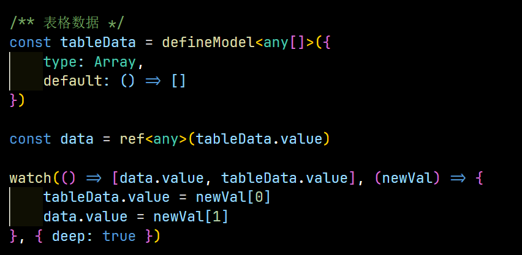

# Vue3踩坑记录

## inject() can only be used inside setup() or functional components

项目跑的时候显示inject() can only be used inside setup() or functional components，是因为不在setup()内部运行inject，导致报错，看了下代码，是因为没有在setup内执行const router = useRouter()  而useRouter内部执行了inject，所以导致报错，改为在方法内执行const router = useRouter() 就可以解决警告

## 刷新页面出现[Vue Router warn]: No match found for location with path警告

最开始项目刷新页面出现警告，然后无法进入页面，查询资料已通过下面方式解决，至此记录下

首先静态路由里面增加404路由

```ts
  // @ts-ignore 
  {
    path: '/:pathMatch(.*)*',
    component: () => import('@/views/Error/404.vue'),
    meta: {
      hidden: true,
      title: '404',
      noTagsView: true
    },
  },
```

❗❗❗要注意不能写name，否则会刷新默认跳转到404页面

## vue3使用defineModel绑定一个数组时触发不了响应式

项目里使用defineModel绑定一个数组时，数据改变了，但是页面没有改变，使用watch也监听不到数据变化，后面发现绑定这个值并没有初始化，这时候会触发不了响应式，所以组件内部要写一个初始值作为中间量，同时监听该值变化时要触发v-model，v-model改变时也要触发该值变化


